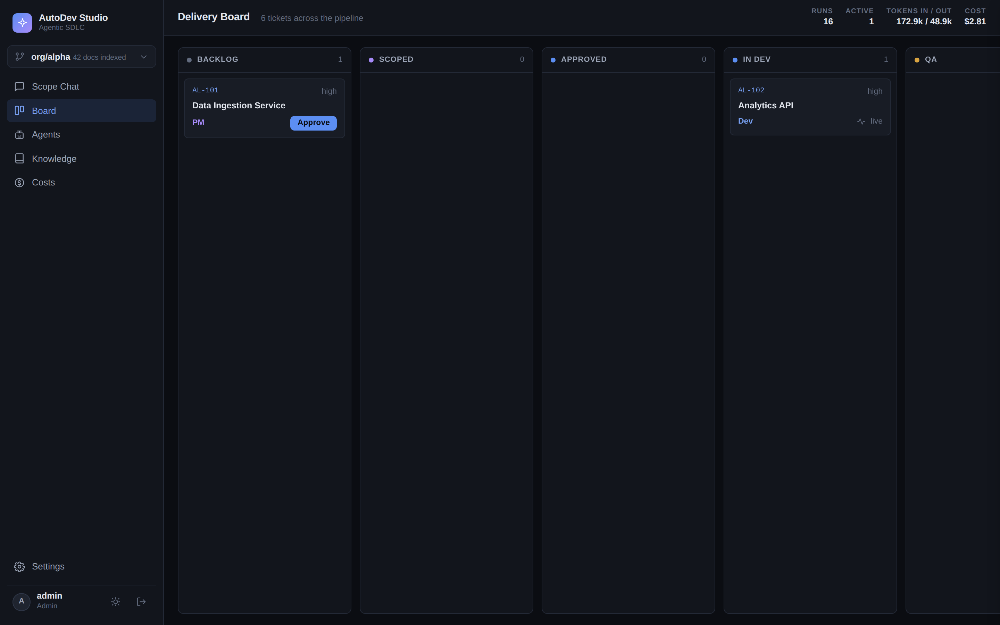
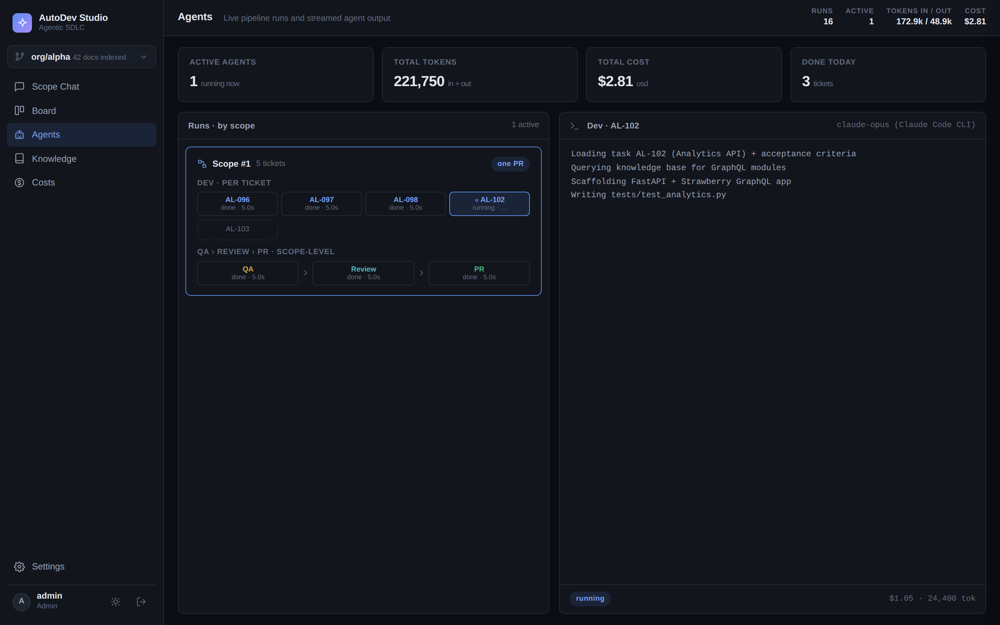
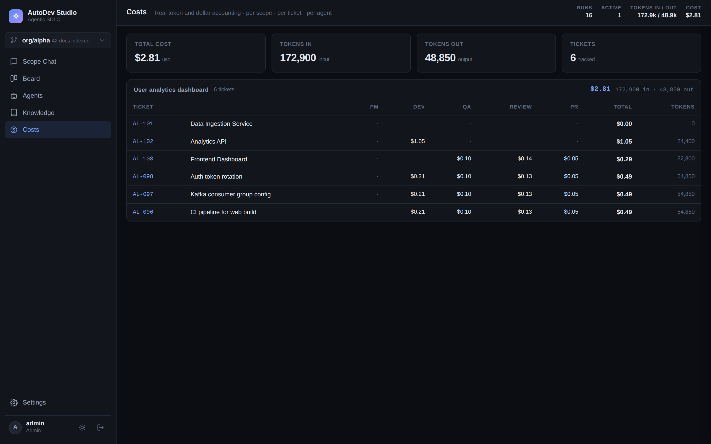
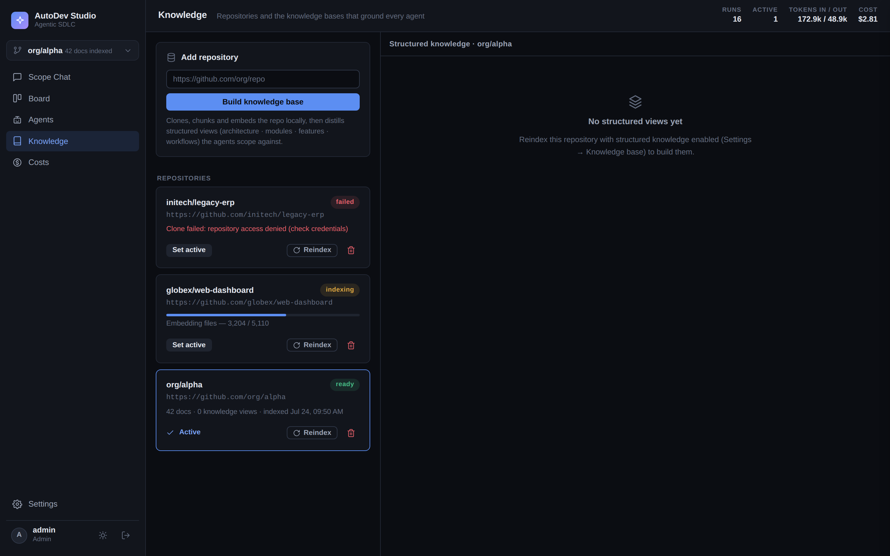
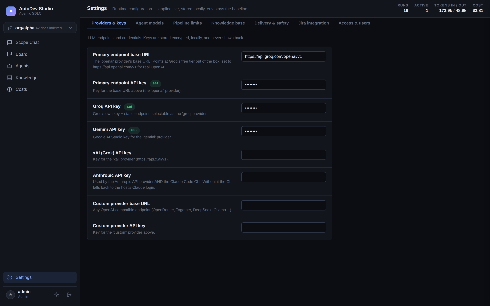
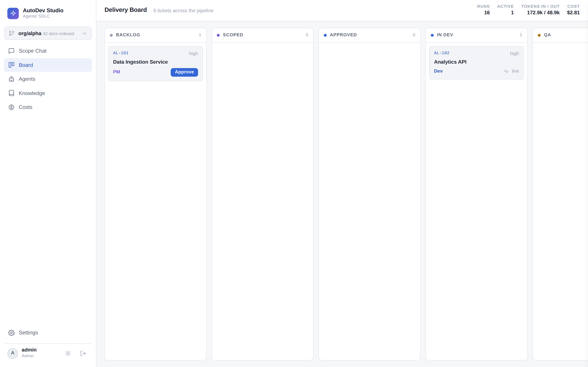

<div align="center">

# AutoDev Studio

**An autonomous, multi-agent SDLC harness.**

Point it at a Git repo, describe a feature in plain English, and a team of AI agents
scopes it, writes the code, tests it, reviews it, and opens a pull request — grounded
in a knowledge base of that repo, with a live board and full cost accounting.

[](https://github.com/krishagarwal314/autodev-studio/actions/workflows/ci.yml)


<br>



<sub>The delivery board — tickets flow through Backlog → Scoped → Approved → Dev → QA → Review → PR, with live token/cost totals in the header.</sub>

</div>

---

## Why this exists

A single "write me code" prompt sends a model into a cold repo to grep around, burn
tokens, and guess. AutoDev Studio instead builds a **knowledge base of the target
repository once**, then feeds each agent a scoped, file-cited slice of it. The result
is cheaper and better-localized changes — and on hard-to-find tasks, it beats a plain
`claude -p` run outright.

### It measurably beats a cold agent on hard tasks

I ran the current pipeline head-to-head against plain Claude Code, giving both systems
the identical plain-English request. On the **two largest repos** tested —
Textualize/rich (~35.6k LOC) and Textualize/textual (~82.5k LOC) — **the tuned pipeline
beat a cold `claude -p` on every task it localized well, by 7% to 75%:**

| Repo | Task | Pipeline | Cold Claude Code | Δ |
|---|---|---:|---:|---:|
| rich | feature | $0.333 | $0.449 | **−26%** |
| rich | cross-cutting bug | $0.456 | $0.828 | **−45%** |
| textual | feature | $0.380 | $0.590 | **−36%** |
| textual | extreme cross-cutting bug | $1.705 | $6.830 | **−75%** |
| textual | medium bug | $1.697 | $2.146 | **−21%** |
| textual | greppable bug | $0.374 | $0.401 | **−7%** |

- **The saving grows with how hard a task is to find.** On the extreme case the cold
  baseline spent **$6.83 over 207 turns** (14.3M tokens) hunting one cache-decorator
  bug; the pipeline localized and fixed it for a quarter of the cost — *and* shipped it
  with a locked scope, independent QA, cross-provider review, and a PR branch the raw
  baseline never produces.
- **What drives baseline cost is *localizability*, not repo size.** A cross-cutting bug
  can cost a cold agent 3.5× the tokens of a greppable one in the *same* repo.
- **It's honest about the edges.** On a *very* cheap task (baseline ~$0.21) the
  five-stage floor can cost more than a cold run saves, and on the hardest bug the cheap
  win shipped a narrower fix than the baseline. The [full report](benchmarks/kb-vs-claude-code.md)
  documents both, plus the earlier un-tuned iterations that led here.

> The benchmark is the interesting part of this project — read it before the code.

---

## Who this is for: the economics of a one-time knowledge base

A cold coding agent pays the **localization tax on every single task** — it re-reads the
repo from scratch to figure out *where* the change goes, every time. On a large codebase
that tax is brutal and recurring: in the benchmark, one cold run spent **$6.83 and 207
turns** just locating a single bug in an 82k-LOC repo. Do that fifty times a week across a
team and you're paying to rediscover the same architecture over and over.

AutoDev Studio pays that cost **once**. Ingesting a repo builds a durable knowledge base —
structured architecture/module/feature views plus an embedding index — that persists on
disk and refreshes incrementally as the repo moves. After that, every task amortizes it:
localization becomes a cheap retrieval instead of an expensive cold hunt.

That makes the value proposition sharpest exactly where real engineering work lives:

- **Teams shipping against the same large repo, day after day.** You don't onboard a new
  codebase every morning — you make change after change to the *same* one. The KB is built
  once and every subsequent ticket rides on it. The more you use a repo, the cheaper each
  task gets relative to a cold agent.
- **Big, hard-to-navigate codebases.** The payoff grows with repo size and with how hard
  changes are to localize — the two things that make a cold agent most expensive are the
  two things the KB most directly neutralizes.
- **Onboarding and tribal knowledge.** The same structured views that ground the agents
  are a queryable map of the system — architecture, workflows, domain rules, integrations —
  extracted from the code, not from a stale wiki.

The break-even is honest and known: for a stream of *tiny*, trivially-greppable edits, a
cold `claude -p` is cheaper because the KB can't save what was never expensive. The KB wins
when work is **repeated, against a substantial repo, on changes that take real finding** —
which is to say, most of what a team actually does.

---

## Features

| | Feature |
|---|---|
| **Repo knowledge base** | Clone → chunk → embed any Git repo into a local vector DB; agents query it for grounded context. Free local embeddings ([fastembed](https://github.com/qdrant/fastembed) `bge-small`) + embedded Qdrant, with a pure-Python TF-IDF fallback that needs no model. |
| **Structured multi-view knowledge** | Beyond chunks, each repo is statically analyzed into interpreted *views* — architecture, modules, features, workflows, entry points, domain concepts, rules, integrations. Facts come from code; only interpretation comes from the LLM. |
| **Language-agnostic** | Symbol extraction, edit-time syntax gates, and test running all dispatch through one language registry — Python (exact `ast`), JS/TS, Go, Rust, Java, and Ruby today. Unsupported languages fail open (still indexed, still edited) rather than breaking the run. |
| **Agentic PM scoping** | A PM agent runs a Socratic clarify-loop, hunting for ambiguity before locking a scope, then drafts concrete engineering tickets. |
| **Human approval gate** | No agent touches code until a human approves the ticket (optionally pushed to Jira). |
| **Dev → QA → Review → PR pipeline** | Runs on an isolated branch of a cloned working copy; opens a real PR via `gh`. |
| **Provider- & model-agnostic** | Every pipeline stage picks its own provider *and* model, live from the UI. Native support for the **Anthropic Messages API**, the **Claude Code CLI**, and **any OpenAI-compatible endpoint** — Groq, OpenAI, Gemini, xAI, OpenRouter, Together, DeepSeek, a local Ollama, whatever. Routing is by provider *kind*, not guessed from the model name. |
| **Cross-provider review** | The model that *writes* the code is deliberately a different family than the one that *reviews* it, to decorrelate blind spots. |
| **Bounded revise loop** | QA/Review feedback is fed back to Dev for up to N rounds, with conservative verdict parsing. |
| **Live board + cost meter** | Kanban lanes, streamed agent logs, and real token/cost breakdowns per ticket, scope, and agent. |
| **Auth + roles** | Cookie-session login with `admin` / `member` / `viewer` roles enforced server-side. |
| **Runtime settings** | API keys, per-stage models/providers, loop bounds, demo mode, and Jira — all editable live from the UI, no restart. Keys encrypted at rest. |
| **Zero-CDN frontend** | Hand-rolled design system (dark/light), inline SVG icons, system fonts — works fully offline. |

---

## Quick start

### Prerequisites
- **Python 3.11+** and **git**
- At least one LLM key — **any** provider works: the native Anthropic API, or any
  OpenAI-compatible endpoint (OpenAI, Groq, Gemini, xAI, OpenRouter, a local Ollama…).
  The defaults target Groq's **free tier**, so you can run the whole thing for $0.
- *Optional:* the **Claude Code CLI** authenticated (best Dev/Review quality; falls
  back to the OpenAI path without it) · the **`gh`** CLI (only to open real PRs)

### Option A — one command

```bash
cp .env.example .env       # add an API key
./run.sh                   # creates a venv, installs, starts on :8017
```

### Option B — Docker

```bash
OPENAI_API_KEY=sk-... docker compose up --build
```

### Option C — manual (installable package)

```bash
pip install -e ".[semantic]"   # omit [semantic] to use the TF-IDF fallback
autodev                        # starts the server (see `autodev --help`)
```

Then open **http://localhost:8017** (API docs at `/docs`). Sign in as `admin` with
the one-time password printed in the server log on first boot (or set `ADMIN_PASSWORD`
in `.env`).

### Try it
1. **Knowledge** → paste a public Git URL → *Build knowledge base* → *Set active*.
2. **Scope Chat** → describe a feature; answer the PM agent until it locks the scope →
   *Draft tickets*.
3. **Board** → approve a ticket → *Run* → watch Dev → QA → Review → PR stream live.
4. **Settings** → set keys, pick a model per stage, tune the revise loop — all live.
5. **Demo mode is on by default**, so the PR stage is a dry-run. Turn it off (and
   authenticate `gh`) only for a repo you own.

> The knowledge base uses free local embeddings in an embedded Qdrant DB — no API key,
> no Docker. The first ingest downloads a ~90 MB model once. Set `RAG_EMBEDDINGS=tfidf`
> to skip embeddings entirely.

---

## How it works

```
ingest repo → build knowledge base
  → PM agent clarifies + drafts tickets → human approval (+ optional Jira)
  → Dev writes code on an agent/<key> branch
  → QA runs tests + reviews          ┐
  → Review checks diff vs criteria    ├─ revise loop ×N on failure
  → PR pushes + opens a real PR       ┘
  → human merges
```

The HTTP request that starts a run returns immediately; the pipeline executes on a
worker thread and streams progress through the database that the UI polls.

### It's a system, not a prompt wrapper

The knowledge base is the clever part, but the machinery around it is what makes it
usable by more than its author:

- **A real state machine, not a chain of `if`s.** The orchestrator drives tickets through
  explicit SDLC lanes with a *bounded* revise loop, and parses agent verdicts with
  deliberately conservative rules — an errored agent is `INCONCLUSIVE`, never silently a
  pass, so an unreviewed change can't slip through looking clean.
- **Honest observability.** Every agent run records real tokens, cost, and duration — read
  straight from the Claude CLI's own meter and each API's usage — rolled up per ticket,
  scope, and agent. The cost numbers in the benchmark come from this, not an estimate.
- **Safe by default.** Demo mode dry-runs the PR stage until you opt in. Auth is required
  everywhere but the login page; roles (`viewer`/`member`/`admin`) are enforced
  server-side; API keys are encrypted at rest.
- **Degrades instead of breaking.** No embedding stack → TF-IDF retrieval. No Claude CLI →
  the OpenAI-compatible edit loop. No Jira → a no-op. It runs fully offline, zero-CDN, on a
  free-tier key.
- **Grounded, not hallucinated.** The structured views take their *facts* from static
  analysis and let the LLM supply only interpretation — so the map the agents
  navigate by is anchored to the real code.

### Keeping the knowledge base fresh, cheaply

The KB doesn't just get built once and go stale as the repo moves on. At the start of
every run it's synced to `origin`'s current commit via two watermarked layers:

- **Symbol map** (file → line-numbered classes/functions/imports): free, deterministic,
  re-analyzed incrementally for only the files that changed since the last sync — so
  it's always *exactly* current, on every run, at zero cost.
- **LLM-written views** (architecture, modules, features, …): watermarked by commit SHA.
  A small drift regenerates just the affected modules' docs; a large drift (many files
  changed) triggers a full rebuild, rate-limited so a hot repo doesn't re-pay ingest cost
  on every commit.

Knowledge that accumulates *across* runs — delivery notes, distilled lessons from past
tickets — survives rebuilds by design instead of being wiped: rebuilds regenerate
interpretation, never history.

### Screenshots

| Agents — live pipeline + streamed output | Costs — real per-ticket, per-agent accounting |
|:--:|:--:|
|  |  |
| **Knowledge — repos & their knowledge bases** | **Settings — any provider, any model, per stage** |
|  |  |

<sub>Hand-rolled design system, zero CDN, dark **and** light themes — here's the board in light mode:</sub>



Full write-ups:
- **[docs/architecture.md](docs/architecture.md)** — components, the pipeline, the
  request flow, cross-provider review, and the revise loop.
- **[docs/knowledge-base.md](docs/knowledge-base.md)** — the RAG index and the
  structured views, and how they degrade gracefully.
- **[docs/configuration.md](docs/configuration.md)** — every environment variable and
  runtime setting.

---

## Development

```bash
pip install -e ".[dev]"    # pytest, pytest-cov, ruff
pytest                     # run the suite (no network; the LLM boundary is mocked)
ruff check backend/app tests
```

Tests cover the security-critical and pipeline-logic paths — encryption at rest,
password hashing and the bootstrap admin, role-based access control, runtime-settings
validation and masking, the revise-loop verdict parsing, and knowledge-base helpers.
CI runs lint + tests on Python 3.11 and 3.12.

See **[CONTRIBUTING.md](CONTRIBUTING.md)** to get started and **[SECURITY.md](SECURITY.md)**
to report a vulnerability.

---

## Tech stack

| Area | Stack |
|---|---|
| Backend | Python, **FastAPI**, **SQLModel** (SQLAlchemy + Pydantic), Uvicorn |
| Database | SQLite |
| Frontend | Jinja2 SSR, vanilla JS, hand-rolled CSS design system (dark/light, zero CDN) |
| Auth | Cookie sessions, PBKDF2 (stdlib), role-based access control |
| LLMs | Claude Code CLI (headless, streaming JSON), Anthropic Messages API, any OpenAI-compatible Chat Completions endpoint |
| Knowledge base | fastembed (`bge-small`) + embedded Qdrant, TF-IDF fallback; static `ast` analysis → per-domain views |
| Integrations | GitHub `gh` CLI, `git`, Jira Cloud REST v3 (optional) |

---

## Roadmap

- Swap the in-process thread pool for a durable queue (Celery / RQ / Arq).
- WebSocket/SSE streaming to the UI instead of polling.
- Sandboxed test execution (containers) for untrusted repos.
- A pluggable agent graph for richer branching/parallelism.
- Workspace-scoped multi-tenancy on top of the existing roles.

---

<div align="center">
<sub>MIT Licensed · FastAPI · provider-agnostic (Anthropic · Claude Code CLI · any OpenAI-compatible endpoint)</sub>
</div>
